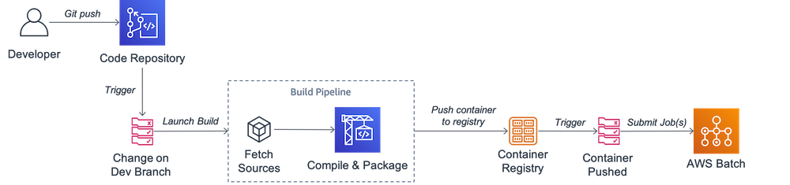

# CI/CD Pipeline with Containerization and Job Execution on Commits

This project deploys an architecture providing a CI/CD pipeline that will
package an application into a container then trigger a job on AWS Batch using
the newly produced container.

The workflow enabled by this architecture can be used to run computational jobs
at scale with AWS Batch. Feel free to modify the architecture based on your needs
and imagination.

## Architecture

This architecture has been built with the [AWS CDK](https://aws.amazon.com/cdk/)
and make use of the following services:

- [AWS CodeCommit](https://aws.amazon.com/codecommit/) as the repository manager.
- [AWS CodeBuild](https://aws.amazon.com/codebuild/) to build the container.
- [AWS CodePipeline](https://aws.amazon.com/codepipeline/) to orchestrate the build pipeline.
- [Amazon ECR](https://aws.amazon.com/ecr/) as the container registry manager.
- [AWS EventBridge](https://aws.amazon.com/eventbridge/) to trigger job submission when containers are stored.
- [AWS Batch](https://aws.amazon.com/batch/) to run the jobs.
- [Amazon Virtual Private Cloud](https://aws.amazon.com/vpc/) to deploy instances that will be running the jobs.

The AWS CDK stack will deploy a repository, the pipeline with the build workflow,
an Amazon ECR repository, a rule to trigger a job when a new container is stored
on the repository, an AWS Batch Compute Environment as well as a Job Queue and
a Job Definition and, a VPC in which instances will be residing.




## How to Deploy

To deploy this architecture, you will need to follow these steps:

1. Create a virtual env and activate it
```
$ python3 -m venv .env
$ source .env/bin/activate
```
2. Install the required dependencies
```
$ pip install -r requirements.txt
```
3. Synthesize the CloudFormation template
```
$ cdk synth
```
4. Deploy the stack
```
$ cdk deploy '*'
```

Your stack will take a few minutes to deploy. The code in the directory
 `app-package` will be uploaded and added to your *AWS CodeCommit* repository.

## Extending the Stack

You can extend the stack to modify the following components:

- Code repository: use Github or Bitbucket.
- Build Pipeline: add other stages, for example to include static code analysis or run tests as part of the integration workflow.
- Job submission: run [Array Jobs](https://docs.aws.amazon.com/batch/latest/userguide/array_jobs.html) instead of a single job.
- Job Execution: replace AWS Batch by another service such as Amazon ECS, Amazon EKS or AWS ParallelCluster.

You could also integrate an [Amazon Lambda](https://aws.amazon.com/lambda/)
function as a target of the Job Submission Rule if you want to integrate
additional logic on the job submission process.
